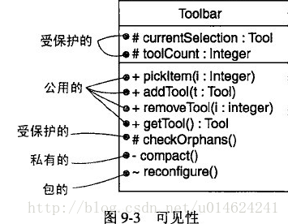

[参考资料](https://design-patterns.readthedocs.io/zh-cn/latest/read_uml.html)

## 模型工程

软件建模是构建正确可信软件系统的基础

### 建模原则

从不同视角建模、使用不同模型建模、选择正确的模型

- 外部视角：对系统上下文或环境建模
- 交互视角：对环境交互或内部元件交互建模
- 结构化视角：对系统的结构或内部数据结构建模
- 行为视角：对系统的行为建模

### 建模工具-UML

建模方法有很多，本文只关注`面向对象建模`

面向对象标准建模方式为UML（Unified Modeling Language）

## UML

### UML的内容组成

- 事物
  - 结构事物：类、接口、组件等
  - 行为事物：交互、状态机
  - 组织事物：包
  - 辅助事物：注释
- 关系
  - 基于继承：实现（继承抽象类）、泛化（继承非抽象类）
  - 聚合（即使整体不存在了，部分仍然存在；例如， 部门撤销了，人员不会消失，他们依然存在；）、组合（如果整体不存在了，则部分也不存在了；例如， 公司不存在了，部门也将不存在了）
  - 关联（一种拥有关系，关联对象通常是以成员变量的形式实现的）、依赖（一种使用关系，依赖关系体现为类构造方法及类方法的传入参数）
- 图
  - 静态图
    - 用例图
    - 类图
    - 对象图
    - 组件图/构建图
    - 配置图/部署图
  - 动态图
    - 时序图
    - 协作图/合作图
    - 状态图
    - 活动图

### UML实践

以软件开发流程为例：

1、需求分析：用例图

2、概要设计：类图、对象图｜ 时序图、状态图、活动图、合作图

3、详细设计：同上

4、编码阶段：无

5、测试：类图、组件图、部署图

### [时序图](https://www.cnblogs.com/ywqu/archive/2009/12/22/1629426.html)

### 常见问题

1、类图中的 + -等符号是什么意思？

UML中，可见性分为4级

- public 公用的 ：用+ 前缀表示 ，该属性对所有类可见

- protected 受保护的：用 # 前缀表示，对该类的子孙可见

- private 私有的：用- 前缀表示，只对该类本身可见

- package 包的：用 ~ 前缀表示，只对同一包声明的其他类可见

## [类图](https://design-patterns.readthedocs.io/zh-cn/latest/read_uml.html)

@startuml
class Customer {
name
address
}
@enduml

